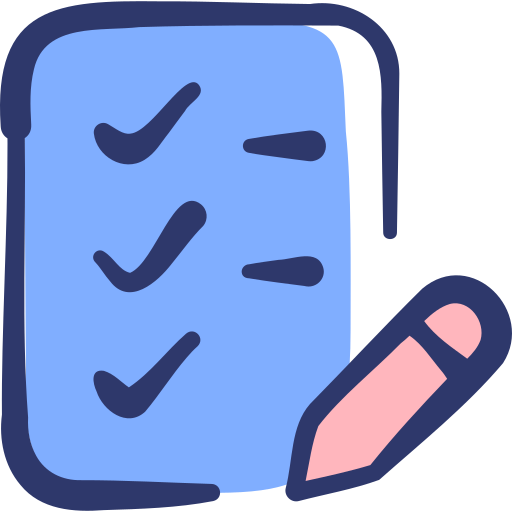
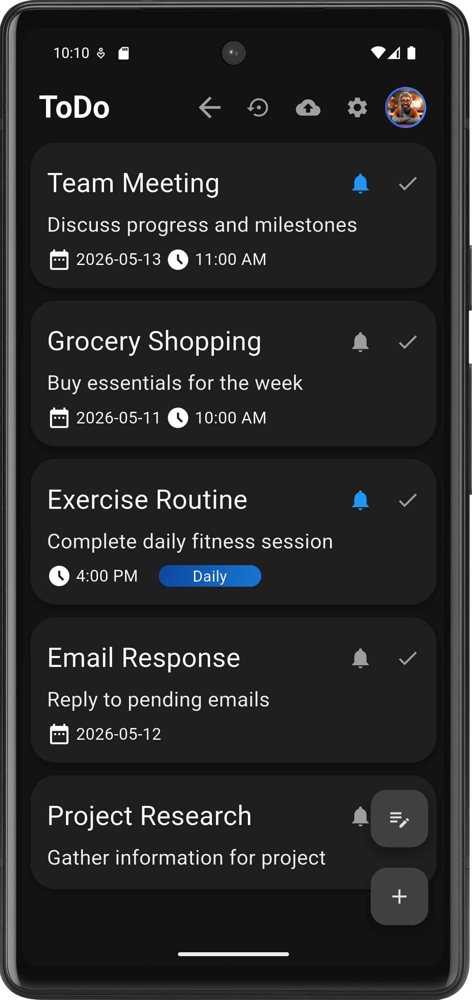
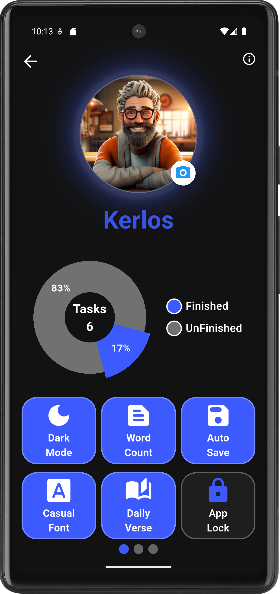
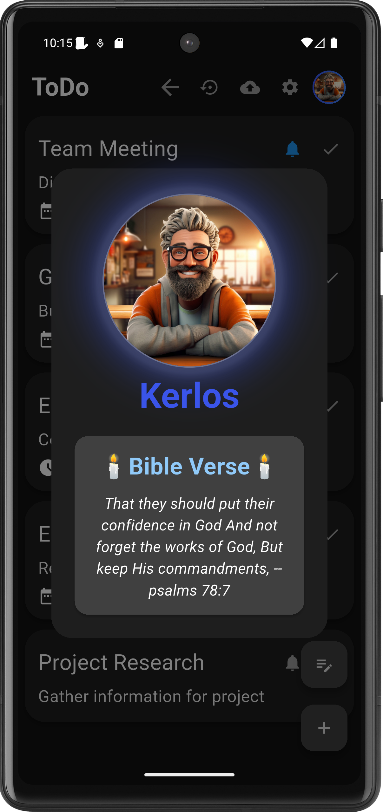
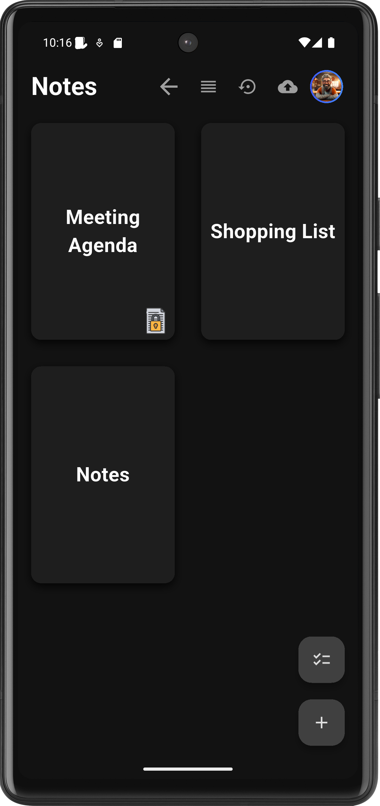
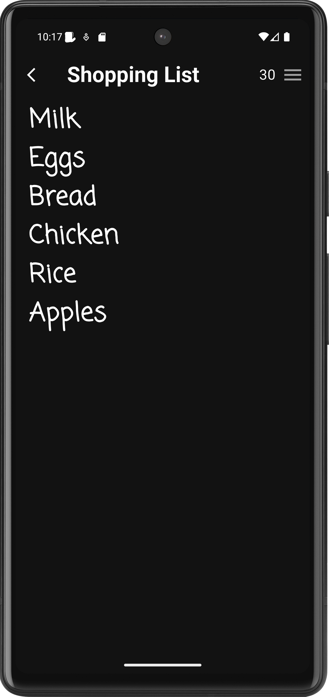

#  Todo

**A minimal, privacy-first app for managing your tasks and notes**

## Features

- **Works Offline**  
  No account. No tracking. No internet needed.

- **Tasks & Notes**  
  Keep your tasks and thoughts organized — side by side.

- **Simple & Fast**  
  Lightweight and responsive with a clean interface.

- **Bible Verse of the Day**  
  Start your day with a moment of inspiration.

- **Home Screen Widget**  
  Keep an inspiring note on your home screen.

- **Reminders**  
  Never forget important tasks.

- **Encrypted Storage**  
  All data is stored securely on your device.

- **Fingerprint Lock**  
  Keep your notes and tasks private with biometric security.

- **Import & Export**  
  Backup and restore securely.

## Screenshots

## License

This project is licensed under the GNU General Public License v3.0

Developed with ❤️ by Kerlos Girgis
